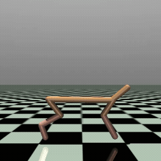

# Visual-CNN--Languege-LLM--Action-model-on-HalfCheetah-and-more

In this repository, suppose we are the robotic engineer try to design a robot and see how it interacts with our physical world, we need to determine which environment we are working in and how our model processes physical information, such as numerical state data, visual observations, or even human commands. 

We utilize MuJoCo as our simulation environment, and select the HalfCheetah-v5 task as our primary testbed, as it provides a relatively simple yet representative control problem. Then we integrate multiple sources of information—such as physical state data, visual inputs, and human commands—into the system, enabling the robot to perceive and respond to its environment.

## About this "Ver.0.9" branch:

This is demo version, only contain simplified text input with strict reward options, raw CNN ingestion, and simple features concatenate.

## Features in this project

Featuring as HalfCheetah-V.5:
- Import PPO from stable_baselines3 package 
- Customized featuresExtractor with:
  - Part of (8 of 17, which contain positions & angles) numerical state data inputs.
  - Deep-CNN image input.
  - Simple text ingestion which demostrate human commands that instruction reward functions.

Note that due to the excessive time of the simulation, we utilized Google drive checkpoints to preventing unintentional abrupt in our learning process. This saving method can be replace with others depending on which serve you best.

### The following features will be add in new version(branch):
- Introduce Vision Transformer (ViT) layers after the CNN module to capture global image structure.
- Apply transformer-based encoders after feature fusion for better global representation learning.
- Replace simple instruction input with LLM to understand more general text inputs.
- Redesign reward function to be more flexible and continuous. (For example, an LLM could map instructions into a latent representation encoding both direction and magnitude (e.g., velocity scaling from -1 to 1), which can then be used to parameterize the reward.)

### Potential improvements:

- Improve parallelization, for example by moving CNN computations to CUDA while avoiding bottlenecks from rendering, or by replacing the rendering pipeline with a more parallelizable alternative.
- Explore the use of vision-language models (VLMs) to jointly process image and text inputs, potentially reducing the need for training CNN modules from scratch and improving efficiency.
- Apply additional reinforcement learning algorithms beyond PPO algorithm.
- Extend our gym from HalfCheetah to other environments to see how our current model was learned or can learn.
- Note that when using DummyVecEnv, the CNN processes only single frames and cannot capture temporal dependencies. So in the future we might have to utilize the "VecFrameStack" to let CNN framework learn more properly.


## Contents of code

VLA\
├── doc_load_embbed.py      # documents loading func. + embbeding func.\
&emsp;&emsp;└── document_loader     # PDF / CSV / TXT / json loader

├── qabot.py                # Gradio entry point \
&emsp;&emsp;├── llm \
&emsp;&emsp;&emsp;&emsp;├── watsonx_llm()    # get_llm() \
&emsp;&emsp;&emsp;&emsp;├── model_id      			# model_id \
&emsp;&emsp;&emsp;&emsp;└── project_id       # project_id \

&emsp;&emsp;├── retrievers\
&emsp;&emsp;&emsp;&emsp;├── parent_retriever  # ParentDocumentRetriever \
&emsp;&emsp;&emsp;&emsp;├── embedding									# watsonx_embedding() \
&emsp;&emsp;&emsp;&emsp;├── vectorstore 						# Chroma()\
&emsp;&emsp;&emsp;&emsp;└── document_loader\

&emsp;&emsp;├── qa_chains + globle chatmemory\
&emsp;&emsp;&emsp;&emsp;├── llm\
&emsp;&emsp;&emsp;&emsp;└── LCEL structure # prompt, chain, chat_memory\ 

&emsp;&emsp;├── gradio\
&emsp;&emsp;&emsp;&emsp;└── gr.Interface\

├── Setting up a virtual environment + requirements.txt   # Necessary libs\

└── README.md

## How to operate

### Mount Drive
- First, you might need to mount the model on the Google drive.

Note that since we want to leveraging the checkpoints saving from the Google drive, we will need to operate following code in Google Colab notebook environment very quick, then we can on our way to model preparation via python files downloading and operating in terminal.

```bash
from google.colab import drive
drive.mount('/content/drive')

```

After the drive is mounted with Colab notebook, we now can execute following command to assigning checkpoints' file location in our Google drive.
```bash
python3 Google_drive.py
```

### Setting up a environment

- Second, you'll need to install necessary packages. You can either use bash command as Section 1, or download "Env_setup.py" to setup environment with Section 2 command, or even just copy "Env_setup_colab" code to Colab notebook.

#### Section 1
```bash

pip install mujoco stable_baselines3 mediapy
apt-get update
apt-get install -y libosmesa6-dev ffmpeg

export MUJOCO_GL=osmesa
```

#### Section 2
```bash
python3 Env_setup.py
```


### Start the training
- Third, after our environment is installed, we can now excute "Train&Rollout.py" to start training and proceed several rollout prediction.

The input image resolution of CNN is declared in "Text_tokenizer.py", and the max training steps and PPO cariables are with "Train&Rollout.py".

```bash
python3 Train&Rollout.py
```

### Render the Mujoco video
- Finally, after we complete the training and rollout, we can render the vedio of model's learning to see how our cheetah will move.

```bash
python Rendering.py
```
The expected result is shown in the vedio below. 


